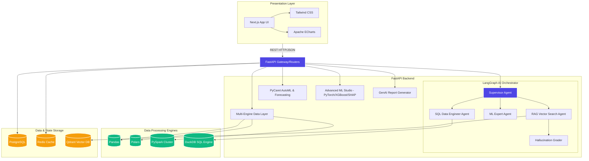

# System Architecture

The AntiGravity Platform is an enterprise-grade AI analytics suite built on a scalable microservices architecture. 

## High-Level Architecture Diagram

## Component Breakdown

1. **Frontend (Next.js):** A highly responsive, glassmorphic UI styled with Tailwind CSS. It communicates statelessly with the FastAPI backend.
2. **LangGraph Swarm:** The brain of the platform. A Supervisor node routes natural language prompts to specialized sub-agents. It includes self-correction loops to eliminate LLM hallucinations.
3. **Data Engines:** Abstracted processors (Pandas, Polars, PySpark) that dynamically scale based on dataset size and distribution needs.
4. **Data Persistence:** 
   - **PostgreSQL:** Primary relational database for user state, saved reports, and connection profiles.
   - **Redis:** High-performance caching layer to instantly return previously computed ML inferences or agent responses.
   - **Qdrant:** Enterprise vector database storing embeddings for the Retrieval-Augmented Generation (RAG) knowledge base.
