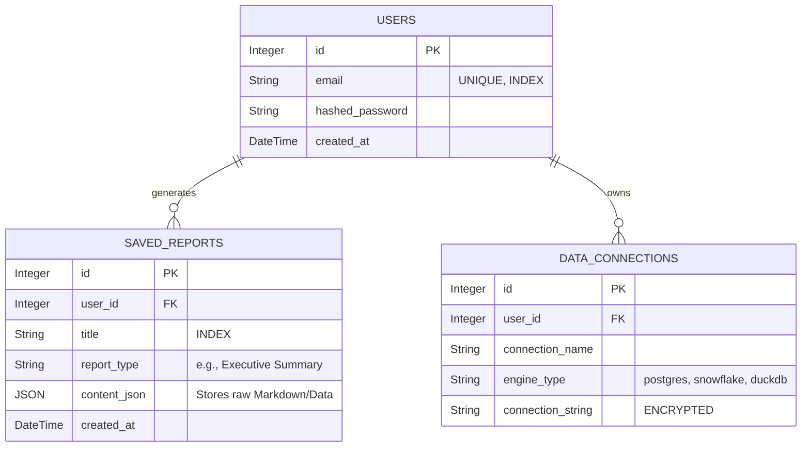

# Database Schema

AntiGravity utilizes two primary data stores: **PostgreSQL** for relational application state, and **Qdrant** for unstructured vector embeddings.

## 1. PostgreSQL Schema (Relational Data)

The relational schema is managed by `SQLAlchemy` ORM and migrated via `Alembic`.



## 2. Qdrant Vector Schema (Unstructured Data)

Qdrant manages the high-dimensional vector space used by the LangGraph RAG Agent to answer queries based on uploaded internal documents.

**Collection Name:** `knowledge_base`
- **Vector Size:** `1536` dimensions (Optimized for `text-embedding-ada-002` or `text-embedding-3-small`).
- **Distance Metric:** Cosine Similarity.

### Payload Metadata (Filtering Attributes)
Each vector in Qdrant contains the following JSON payload to allow the LangGraph agent to apply strict pre-filtering:
```json
{
  "source_document": "Q3_Financial_Report.pdf",
  "page_number": 12,
  "chunk_index": 45,
  "author": "Finance Dept",
  "upload_date": "2026-10-15T00:00:00Z"
}
```
